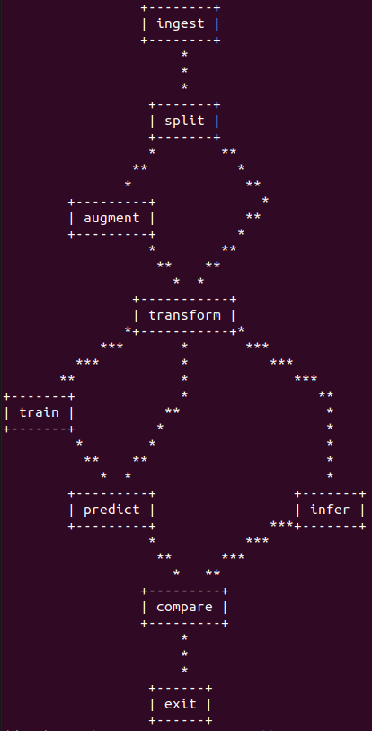

# Pedestrian Detection & Segmentation MLOps Pipeline

## DVC pipeline for Pedestrian Detection & Segmentation using Detectron2 with Data Versioning

<p align="center">
    
</p>


# Getting Started
## 1. Create a Python environment
```shell
python3 -m venv <env_name>
source <env_name>/bin/activate
```

## 2. To initialize DVC and GIT
```shell
pip3 install dvc
git init
dvc init
```

## 3. Installing dependencies
To install requirements for running object detection pipeline with Detectron2

Requires PyTorch, CUDA(if GPU Enabled)

Based on cuda version, install pytorch version and check

https://detectron2.readthedocs.io/en/latest/tutorials/install.html
(Install Pre-Built Detectron2 (Linux only))

Current System - 
nvcc -V = 10.1, V10.1.243

nvidia-smi = NVIDIA-SMI 525.85.12    Driver Version: 525.85.12    CUDA Version: 12.0   

```shell

pip3 install --upgrade pip
pip3 install -r requirements.txt
pip install torch==1.9.0+cu111 torchvision==0.10.0+cu111 torchaudio==0.9.0 -f https://download.pytorch.org/whl/torch_stable.html
python -m pip install detectron2 -f \
  https://dl.fbaipublicfiles.com/detectron2/wheels/cu111/torch1.9/index.html

(For Current Machine torch version 1.9.0, Cuda 10.1)

````

## 4. Setting paramenters
Here dcount is the number of versions of datasets uploaded(dcount = 0 when initialised)
```
# file params.yaml
ingest:
    dcount:0
```

## 5. Pipeline DAG
```shell
dvc dag
```

## 6. To run DVC pipeline
```shell
dvc repro
```

## 7. Adding pipeline stage

```shell
dvc run -n <Stage_name> 
    -p ingest.dcount -p <add parameters> 
    -d src/<Stage_file>.py -d <Any dependencies>
    -o data/<Output dir> 
    python3 src/prepare.py
```